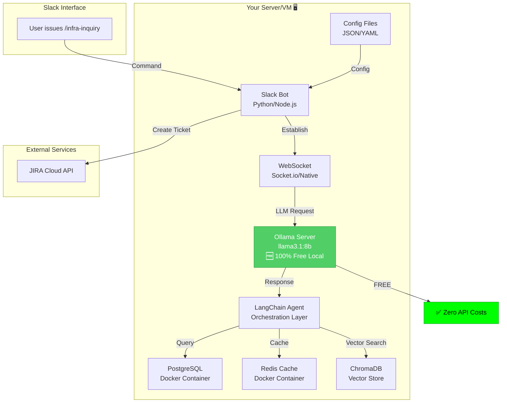

```mermaid
graph TB
    subgraph "Slack Interface"
        A[User issues /infra-inquiry]
    end
    
    subgraph "Your Server/VM 🖥️"
        B[Slack Bot<br/>Python/Node.js]
        C[WebSocket<br/>Socket.io/Native]
        D[Ollama Server<br/>llama3.1:8b<br/>🆓 100% Free Local]
        E[LangChain Agent<br/>Orchestration Layer]
        F[PostgreSQL<br/>Docker Container]
        G[Redis Cache<br/>Docker Container]
        H[ChromaDB<br/>Vector Store]
        I[Config Files<br/>JSON/YAML]
    end
    
    subgraph "External Services"
        J[JIRA Cloud API]
    end
    
    A -->|Command| B
    B -->|Establish| C
    C -->|LLM Request| D
    D -->|FREE| COST[✅ Zero API Costs]
    D -->|Response| E
    E -->|Query| F
    E -->|Cache| G
    E -->|Vector Search| H
    B -->|Create Ticket| J
    I -->|Config| B
    
    style D fill:#51cf66,stroke:#2f9e44,color:#fff
    style COST fill:#00ff00,stroke:#2f9e44,color:#000
```